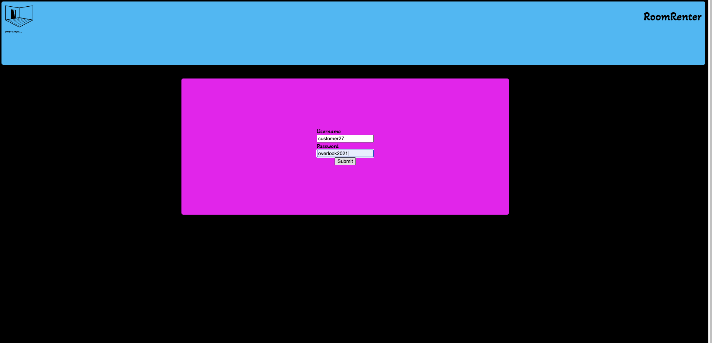

# RoomRenter

## Contributors

* [Joel Thomas](https://github.com/Shakikka)

## Reviewers

* [Jackson McGuire](https://github.com/Jacksonmcguire)

## Technologies Used:

* JavaScript
* CSS
* HTML

## Project Board

* [trello](https://trello.com/b/TPtC1feD/room-renter)

## Install and Deploy Link:

* In your terminal, enter `git clone https://github.com/Shakikka/room-renter`
* run `npm install`, then `npm start`
* In a new terminal tab, enter `git clone https://github.com/turingschool-examples/overlook-api`
* run `npm install`, then `npm start`
* [Click here to open RoomRenter](http://localhost:8080/?)

## How to Use:

* First you will want to log in with any `username` from `customer1` to `customer50`.
The `password` will always be `overlook2021`.

* On the left you will see a list of bookings that your user already has. On the
 right side you will see a calendar. If you click on the icon, you will be prompted
 to pick a date, or if you're feelin' it, you can enter your own date manually.

* A list of available rooms for that date should appear with radio buttons. You
may click the radio button of your choosing that is associated with a room that you
would like to reserve, or you may filter the room list by the room type that you
prefer.

* After selecting a room, you can hit the `Book it!` button, and it will add it
to your list of already existing room bookings! How exciting!

### Future Additions

* Scroll bar and button redesign
* Add Images, and make rooms into visual cards
* Replace radio buttons with actual buttons
